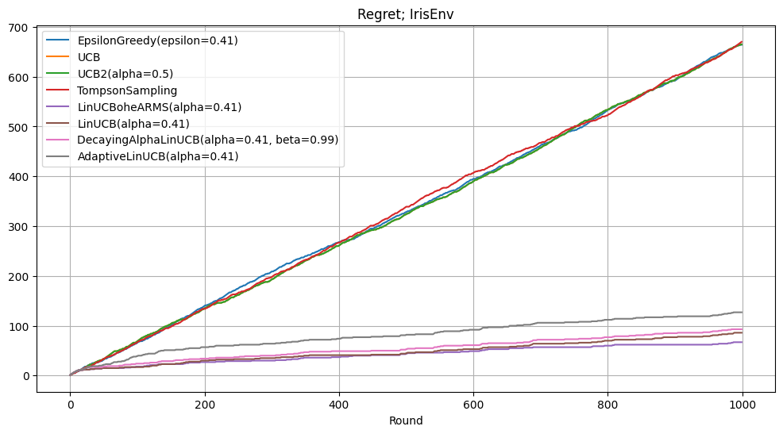

# Contextual Multi-Armed Bandits

This repository provides **modular implementations** of bandit algorithms, including:  

### **Classic (Non-Contextual) Bandits**  
- `ε-Greedy`  
- `UCB1` / `UCB2` 
- `Thompsom-Sampling`

### **Contextual Bandits**  
- `LinUCB` (linear UCB)  
- `LinUCB wit OHE arms`
- `Adaptive LinUCB`
- `Decaying Alpha LinUCB`




## Project Structure & Launch

### Project Structure

```
CtxMAB_RL/
├── src/                  # Core algorithm implementations
│   ├── bandits/     # Base class + non-contextual bandits (ε-Greedy, UCB, Thompson) + Contextual bandits (LinUCB variants)
│   ├── dataset/      # Base class + varios Data environment
│   ├── utils/          # Helpers
│   └── launch.py
├── data/                  # Data for doc
├── notebooks/             # Jupyter experiments
│   └── CtxMAB_RL.ipynb  # Main analysis notebook
└── run.py                 # Command-line interface
```

### How to run

#### Option 1: Jupyter Notebook

    jupyter notebook notebooks/CtxMAB_RL.ipynb

#### Option 2: Main.py

```python
algorithms = [
        MwP(DecayingAlphaLinUCB, alpha=0.41, beta=0.99),
        MwP(AdaptiveLinUCB, alpha=0.41),
        MwP(Algorithm, **params)
    ]
process = Launching(
        n_episodes=1000, # Number of training episodes
        models=algorithms, # List of bandit algorithms to compare
        env=IrisEnv(), # Environment/dataset wrapper
        random_seed=19, # Random seed for reproducibility (default=19)
        save_results=False, # Whether to save experiment results (default=False)
        plotting=False,  # Whether to generate live plots (default=False)
        path_to_save="/experiments/",  # Output directory for results (default="/experiments/")
)
process.launch()
```

### Saved results

Results are saved as a Python dictionary in pickle format containing:
```
{
    "regret_history": [],  # Cumulative regret values at each timestep
    "reward_history": []   # Immediate rewards received at each timestep
}
```