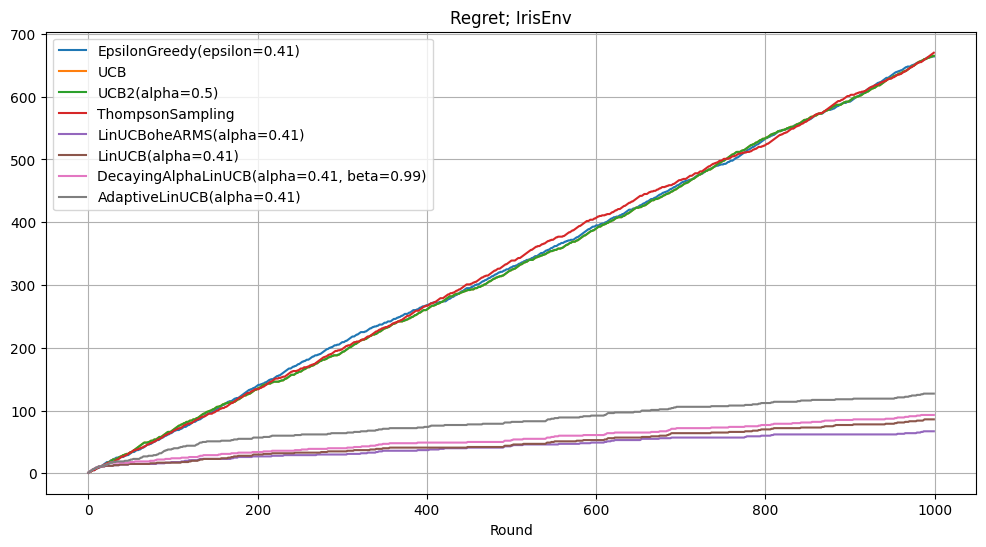

# Contextual Multi-Armed Bandits

This repository provides **modular implementations** of bandit algorithms, including:  

### 🔹 **Classic (Non-Contextual) Bandits**  
- `ε-Greedy`  
- `UCB1` / `UCB2` 
- `Thompsom-Sampling`

### 🔹 **Contextual Bandits**  
- `LinUCB` (linear UCB)  
- `LinUCB wit OHE arms`
- `Adaptive LinUCB`
- `Decaying Alpha LinUCB`

